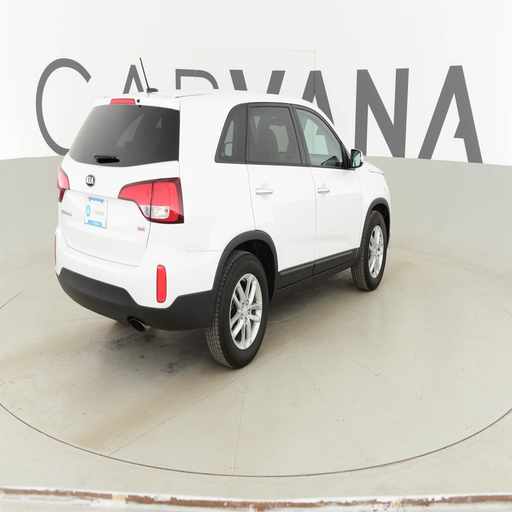

# NovaInfer

## Overview

Written by C++, Novainfer is a deep learning inference framework in development. It is named as "nova" becasue I am a beginner in the filed of deep learning and trying to make progress step by step. My aim is to make it be able to deploy most of models and support CUDA acceleration one day.

## Development environment and libraries used
* operating system : Ubuntu 22.04.4
* C++ standard : C++17
* model format : [PNNX](https://github.com/Tencent/ncnn/tree/master/tools/pnnx)
* linear algebra library : [Eigen3](https://eigen.tuxfamily.org/index.php?title=Main_Page)
* log library : [spdlog](https://github.com/gabime/spdlog)
* unit test library : [Catch2](https://github.com/catchorg/Catch2)
* threading : OpenMP

## Firmware-based accleration 

* Intel MKL<br> --Intel MKL would be leveraged by Eigen3 if it's found by the build tool on an Intel platform

## Install
```bash
$ git clone https://github.com/skystriker1997/NovaInfer.git
$ cd NovaInfer && mkdir build && cd build
$ cmake .. && make -j
```
## Demo

### U-Net

🥳 **_update_**

I am working to make NovaInfer perfectly support U-Net. As displayed below, it does not generate proper output based on the sample model, so I am trying to fix it. 🧐

  


## Sample models
https://mega.nz/folder/FW1nRKwZ#L9ij4_5SGut9NfN7QDUW6w


